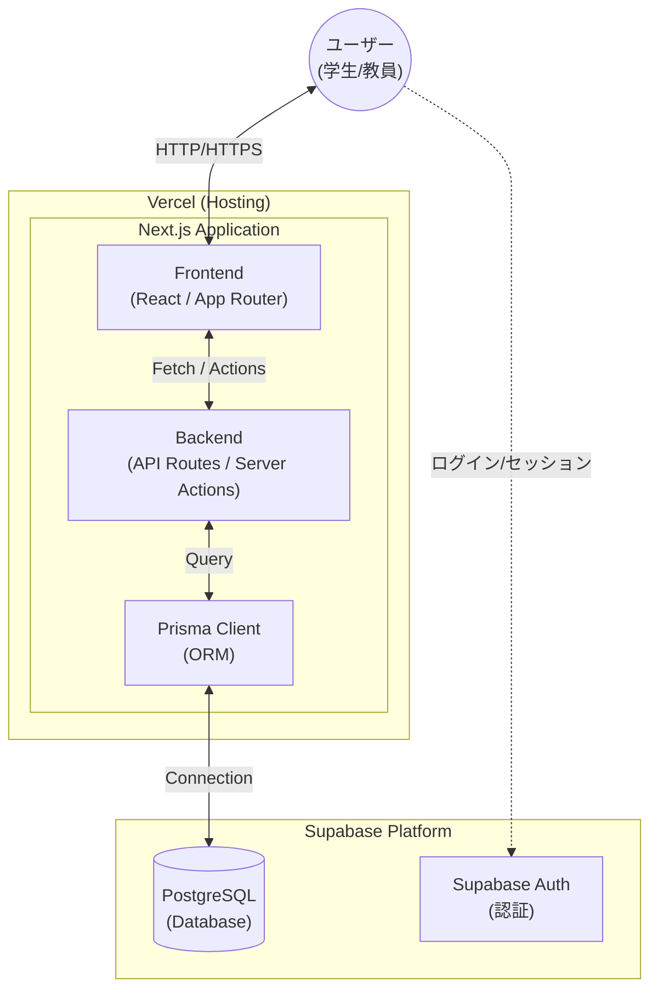

# Attendance & Grade Tracker (クラス出席・成績管理アプリ)

学生が自身の欠席日数と成績を正確に把握し、計画的な単位取得をサポートするためのウェブアプリケーションです。

クラス全体の欠席状況を匿名で一覧表示する共有ビューと、個人の成績目標から逆算して必要な点数を提示するダッシュボードを備え、情報共有と自己管理の両立を目指しています。

## 開発の背景・経緯
「あと何回休んでも落単しないか」「総合評価で合格ラインに達するには次のテストで何点必要なのか」という管理が複雑化し、大変だったため、総合的に管理するアプリを開発しようと考えました。

「シラバスの評価基準や欠席上限の計算を自動化し、視覚的に警告を出してくれるシステムがあれば、留年や落単のリスクを未然に防げるのではないか？」と考えたのが本アプリ開発のきっかけです。また、クラス全体で状況を共有することで、互いに助け合う雰囲気を作りたいという思いも込めています。

## 公開URL
https://attendance-tracker-three-pi.vercel.app/

## 特徴と機能の説明

### 1. 【全体共有ビュー】クラスのピンチを可視化（非ログイン時）
- クラス全員の「あと何回休めるか（欠席余裕回数）」を一覧表示します。
- プライバシーに配慮し、本名ではなく「出席番号」や「ニックネーム」で表示。
- **工夫点**: 「あと休める回数が2回以下」になった生徒を画面最上部に目立つようにハイライト表示し、クラスメイト同士のサポートを促します。

### 2. 【個人ダッシュボード】単位取得のための逆算機能（要ログイン）
- 出席番号とパスワードでログインし、自分自身の詳細な記録を管理します。
- **成績逆算**: 現在のテスト点数と平常点（自己評価）を入力すると、「総合60点をクリアするために、次回のテストで何点必要か」を自動計算して提示します。
- **留年アラート**: 特定の科目で欠席上限が近づいた場合（残り3回以下）や、落単確定の科目が合計「7単位」以上になった場合に重大な警告を表示します。

### 3. 【管理者機能】柔軟なシラバス・時間割対応
- 管理者権限を持つユーザーは、科目ごとの「学修単位フラグ（必要授業数が半期になる設定）」や「テストと平常点の評価割合」「年間テスト回数」を柔軟に登録・カスタマイズできます。
- 休講や補講のスケジュール調整もシステムに反映され、欠席上限の計算ロジック（総授業コマ数の1/3）に自動で組み込まれます。

## 使用技術 (技術スタック)

**フロントエンド・バックエンド**
- TypeScript
- Next.js (App Router)
- React
- Tailwind CSS

**データベース・ORM**
- PostgreSQL (Supabase)
- Prisma

**認証・セキュリティ**
- bcryptjs (パスワードハッシュ化)

**インフラ・デプロイ**
- Vercel
- GitHub Actions (Supabaseのスリープ防止用定期Ping処理)

**開発ツール**
- Visual Studio Code
- Git / GitHub

## システム構成図

## 開発期間・体制
- **開発体制**: 個人開発
- **開発期間**: 2026年2月 〜 現在 (約30時間)

## 工夫した点・苦労した点
- **複雑な計算ロジックの実装**: 科目ごとに異なる単位数、学修単位の有無、休講・補講の変動要素を考慮し、「総コマ数の1/3」という欠席上限を正確に算出するコアロジックの設計に注力しました。
- **Next.js (App Router) と Prisma の連携**: サーバーサイドでのデータフェッチと、TypeScriptの型安全性を活かしたデータベース操作を実現しました。環境構築時のモジュール解決（ESMとCommonJSの違いによるエラー）のトラブルシューティングを通して、最新のNode.js環境への理解が深まりました。

## 既知の課題と今後の展望
- **UI/UXの改善**: ログイン後の個人ダッシュボードにおいて、より直感的にテスト目標点数がわかるようにグラフ描画ライブラリ（Rechartsなど）の導入を検討しています。
- **通知機能**: 欠席上限が近づいた際に、メールやLINE等で自動通知を飛ばす機能の拡張をロードマップに入れています。

## 連絡先
- **Portfolio**: [私のポートフォリオサイト](https://an-nn-t.github.io/portfolio/)
- **GitHub**: [https://github.com/an-nn-t](https://github.com/an-nn-t)